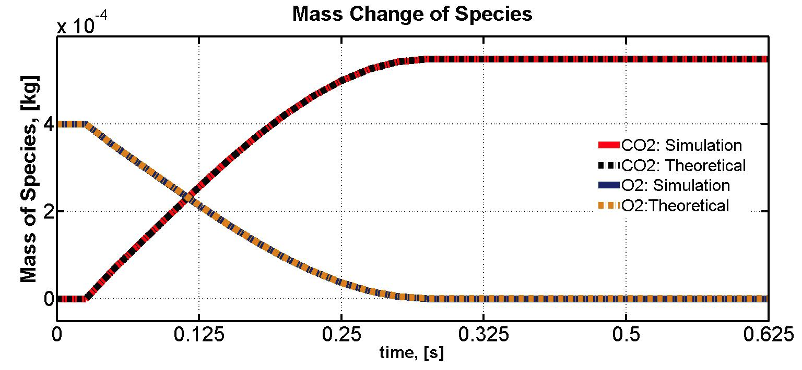

## Shrinking Particle with Chemical Reactions

(c) 2016 M. Efe Kinaci, Department of Particulate Flow Modelling, Johannes Kepler University Linz

##### Testcase Source

[Shrinking Particle Model](https://github.com/ParticulateFlow/CFDEMcoupling/tree/feature/cfdemSolverRhoPimple/tutorials/cfdemSolverRhoPimpleChem/Shrinking_particle_model)

##### Software Sources

[CFDEMcoupling PFM (feature/cfdemSolverRhoPimple)](https://github.com/ParticulateFlow/CFDEMcoupling/tree/feature/cfdemSolverRhoPimple)  
[LIGGGHTS PFM (feature/chemistry)](https://github.com/ParticulateFlow/LIGGGHTS/tree/feature/chemistry/src)

##### Technology Readiness Level

[5](https://en.wikipedia.org/wiki/Technology_readiness_level)

##### Abstract

**Shrinkage of a particle due to chemical reaction kinetics.**

With the use of the Shrinking Particle Model (SPM), in which the particle reacts with the reacting fluid without forming an ash layer behind (Fig. left), the communication framework is tested between the CFD and DEM sides for chemical reactions. In the test case, a single particle reacts with the reactant gas and shrinks according to a user defined reaction rate coefficient (k). The particle is removed from the domain after it reaches the minimum radius value, which is either given by the user or calculated from the Hertzian time step for multiple particles. The case is verified by comparing the rate of change of masses. The graph below demonstrates the rate of change of mass for the reactant gas species O2 and for the product species CO2 for the given case.

 

##### Output

Radius of particle over time

##### References

[C. Y. Wen. _Noncatalytic Heterogeneous Solid Fluid Reaction Models._ Industrial and Engineering Chemistry Research, 60(5):34–54, 1968.](http://pubs.acs.org/doi/abs/10.1021/ie50705a007)

Octave Levenspiel. _Chemical Reaction Engineering_. 1999.

##### Known Limitations

* This case has been formulated in order to test the communication framework for chemical reactions.
* Only up to 355 particles were tested - max available particles without overlap in current domain.

##### Tested By

M. Efe Kinaci (JKU/PFM), 12 Dec 2016

##### Extended Documentation

[fix chem/shrink command](https://github.com/ParticulateFlow/LIGGGHTS/blob/feature/chemistry/doc/fix_chem_shrink.html)
