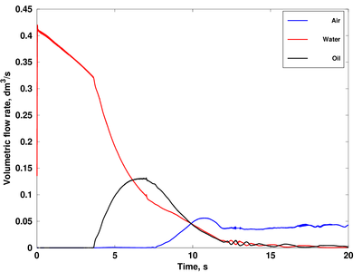

## Tank drainage

(c) 2016 Mathias Vangö, JKU/PFM

##### Testcase Source

[CFDEMcoupling-PFM github repo](https://github.com/ParticulateFlow/CFDEMcoupling/tree/feature/OF4x-multiphase/tutorials/cfdemSolverMultiphase/tankDrainage)

##### Software Sources

* [CFDEMcoupling-PFM branch feature/OF4x-multiphase](https://github.com/ParticulateFlow/CFDEMcoupling/tree/feature/OF4x-multiphase)
* [LIGGGHTS-PFM branch develop](https://github.com/ParticulateFlow/LIGGGHTS/tree/develop)
* [OpenFOAM-4.x](https://github.com/OpenFOAM/OpenFOAM-4.x)

##### CiteMe

N/A

##### Technology Readiness Level

7

##### Abstract

This testcase runs with the self-implemented solver cfdemSolverMultiphase. It is a coupled VOF (Volume of Fluid) and DEM (Discrete Element Method) model capable of handling n continuous phases, similar to the ones described in [1]](#ref1) and [[2]](#ref2). The testcase simulates the drainage of a stratified water-oil-air system through a densely packed particle bed. The flow is purely gravity driven, i.e. atmospheric pressure boundary conditions is used at the top as well as at the outlet. The left image below shows a snapshot of the simulation and the right image depicts the monitored volumetric outflow rate of the different fluids.

 

##### Output

Volumetric flow rate

##### References

<a name="ref1">\[1\]</a> Sun, Xiaosong, and Mikio Sakai. "Three-dimensional simulation of gas–solid–liquid flows using the DEM–VOF method." Chemical Engineering Science 134 (2015): 531-548.

<a name="ref2">\[2\]</a> Jing, L., et al. "Extended CFD–DEM for free‐surface flow with multi‐size granules." International Journal for Numerical and Analytical Methods in Geomechanics 40.1 (2016): 62-79.

##### Known Limitations

* Smoothing of the exchange fields is necessary to keep the volume fractions bound to 1.
* Simulating lightweight dense particle beds leads to severe stability issues. Additional treatment is necessary.

##### Tested By

Mathias Vangö (JKU/PFM), 24.11.2016

##### Extended Documentation

N/A
