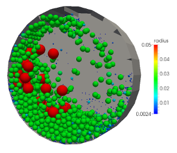
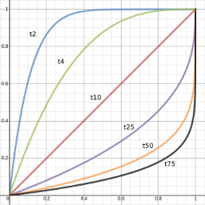
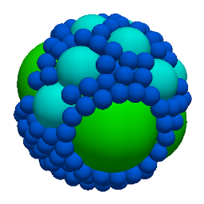

## Particle Fragmentation in Ball Mill

(c) 2015 Daniel Queteschiner, Department of Particulate Flow Modelling, Johannes Kepler University Linz

##### Testcase Source

[Ball Mill](https://github.com/ParticulateFlow/LIGGGHTS/tree/feature/fragmentation/examples/LIGGGHTS/PFM/fragmentation/milling/ballmill)

##### Software Sources

[LIGGGHTS PFM (feature/fragmentation)](https://github.com/ParticulateFlow/LIGGGHTS/tree/feature/fragmentation)

##### CiteMe

Queteschiner, D., Lichtenegger, T. and Pirker, S. "A versatile particle fragmentation model using the discrete element model", presentation given at PARTICLES 2015 IV International Conference on Particle-Based Methods, 28 Sep 2015, Barcelona

##### Technology Readiness Level

[4](https://en.wikipedia.org/wiki/Technology_readiness_level)

##### Abstract

**Application of the Discrete Fragmentation Method (DFM) for spherical brittle particles using an impact energy criterion.**

Based on the Weibull distribution the implementation of the DFM  allows for different breakage criterions such as the von Mises stress or the accumulated damage caused by a number of impacts, the latter of which is used in this test case. The number and size of fragments replacing the original particle are derived at the moment of breakage (tn family). The random packaging of the fragments into the volume of the original particle leads to a compression of the child particles and in further consequence to an unphysical repulsive normal force between them. The model resolves this problem by limiting these forces by the actually available elastic energy of the particles. Thus, mass, momentum and energy are conserved. To counter the vast number of particles created by consecutive breakage events, the breakability of particles can be limited by a minimum size, below which no further fragmentation will occur.

  

##### Output

Number and size of particles over time (i.e. grinding times)

##### References

[Bruchmüller, J., van Wachem, B.G.M., Gua, S. and Luo, K.H. "Modelling discrete fragmentation of brittle particles", Powder Technology 208, 2011, 731–739](http://dx.doi.org/10.1016/j.powtec.2011.01.017)

[Esnault, V.P.B. and Roux, J.-N. "3D numerical simulation study of quasistatic grinding process on a model granular material", Mechanics of Materials 66, 2013, 88–109](http://dx.doi.org/10.1016/j.mechmat.2013.07.018)

##### Known Limitations

* Fraction of original momentum that goes into the extension of cracks (momentum factor eMF) is supposed to be constant.
* The dissipated energy is neglected when comparing the particle energy before and after the breakage event.
* May become unstable if insertion volume for fragments gets smaller than fragments size (i.e. very large initial overlaps of fragments).

##### Tested By

Daniel Queteschiner (JKU/PFM), 10 Feb 2015

##### Extended Documentation

[fix break/particle command](https://github.com/ParticulateFlow/LIGGGHTS/blob/feature/fragmentation/doc/fix_break_particle.html), [fix particletemplate/fragments command](https://github.com/ParticulateFlow/LIGGGHTS/blob/feature/fragmentation/doc/fix_particletemplate_fragments.html)
