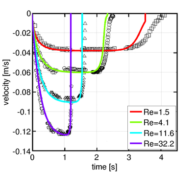

## Sedimenting Sphere

(c) 2016 Philippe Seil, JKU/PFM

##### Testcase Source

[LBDEMcoupling-public github repo](https://github.com/ParticulateFlow/LBDEMcoupling-public/tree/master/examples/sedimentingSphere)

##### Software Sources

* [LBDEMcoupling-public](https://github.com/ParticulateFlow/LBDEMcoupling-public)
* [LIGGGHTS-PFM branch develop](https://github.com/ParticulateFlow/LIGGGHTS/tree/develop)
* [Palabos v1.5r1 (no github repo yet)](http://www.palabos.org/images/palabos_releases/palabos-v1.5r1.tgz)

##### CiteMe

Seil, P. , Kloss, C., Latt, J., Pirker, S., "LBDEMcoupling: A Tool for Efficient Coupled Simulation of Fluid-Particle Systems", presentation given at ICMMES 2014, July 16 2014, New York City

##### Technology Readiness Level

7

##### Abstract

This testcase simulates a sphere settling under gravity in a tank of fluid. The position and velocity over time are monitored and can be compared to experimental results by Ten Cate et al. [[1]](#ref1). The image below shows a comparison of the published data (symbols) and simulation results (lines) for four Reynolds numbers.

##### Output

Sphere position and velocity

##### References

<a name="ref1">\[1\]</a> Ten Cate, A., et al. "Particle imaging velocimetry experiments and lattice-Boltzmann simulations on a single sphere settling under gravity." Physics of Fluids (1994-present) 14.11 (2002): 4012-4025.

##### Known Limitations

This code is only tested in the range of Reynolds numbers used in the original paper. Also, it is designed to only run on a single core.

##### Tested By

Philippe Seil (JKU/PFM), 5.4.2016

##### Extended Documentation

README.md file in testcase source folder
